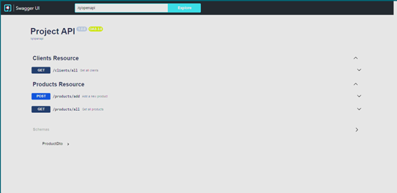
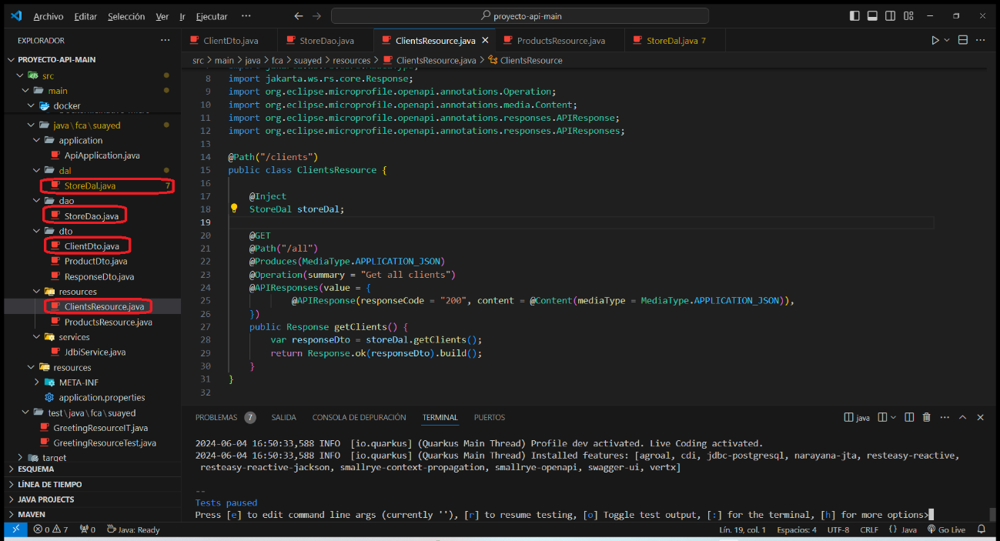
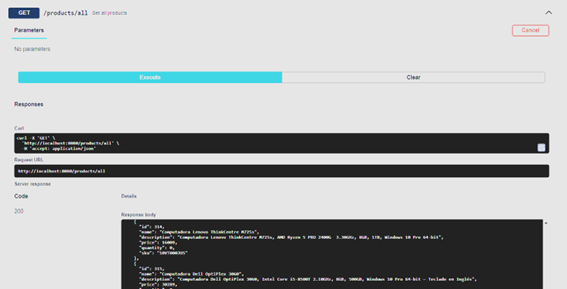
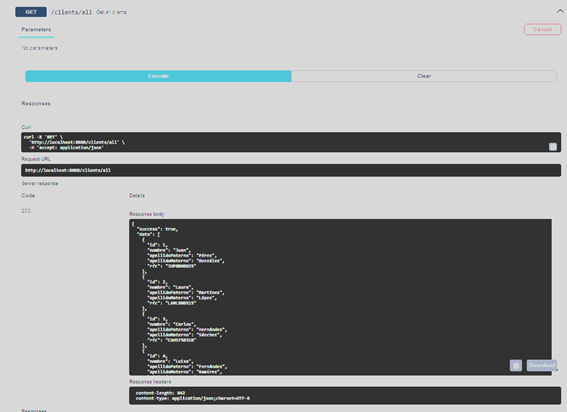
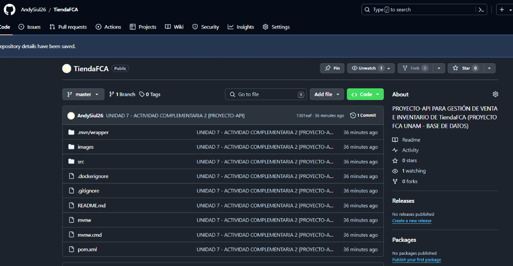

# Actividad Complementaria 2 Unidad 7: Nuevas tecnologías Bases de Datos FCA - UNAM

## Información del alumno
- Nombre: Luis Andrés Castro Nagel
- Grupo: 8491
- Asesor: Juan Manuel Martínez Fernández

## Desarrollo de la actividad

### a) Descarga del proyecto API desde GitHub
El proyecto API se encuentra en el siguiente enlace de GitHub:
https://github.com/tiempor3al/proyecto-api

### b) Completar los endpoints faltantes
Se ha creado el endpoint Get para `/clients/all`, el cual muestra todos los clientes registrados en la base de datos:

Para la creación del endpoint Get para `/clients/all` se han creado y modificado los siguientes archivos Java dentro del proyecto:

### c) Ejecución del proyecto y prueba de endpoints

#### Endpoint GET /products/all
Al ejecutar el endpoint GET `/products/all`, se obtiene lo siguiente:

El endpoint GET `/products/all` devuelve una lista de todos los registros de la tabla "productos". La respuesta está en formato JSON y contiene un arreglo de objetos, cada uno representando un producto con sus respectivos campos.

#### Método getClients
El endpoint GET `/clients/all` debe devolver una lista de todos los registros de la tabla "clientes". La respuesta, al igual que en el endpoint anterior, está en formato JSON y contiene un arreglo de objetos, cada uno representando un cliente con sus respectivos campos.

Después de la creación del endpoint GET `/clients/all`, podemos comprobar que devuelve lo mencionado anteriormente:

### d) Creación de repositorio en GitHub y subida de cambios
Se ha creado un repositorio en GitHub para alojar los cambios realizados en el proyecto:

### e) Enlace al repositorio
El enlace al repositorio del proyecto se encuentra a continuación:
https://github.com/AndySiul26/TiendaFCA

---
### Notas
-> Se dejó un script psql para crear la base de datos que se ha ido construyendo durante el semestre con las tres tablas "productos", "clientes", "ordenes".
---
## Referencias
- Martinez Fernandez, J. M. (s.f.). Proyecto-Api para el desarrollo de la actividad. Obtenido de https://github.com/tiempor3al/proyecto-api